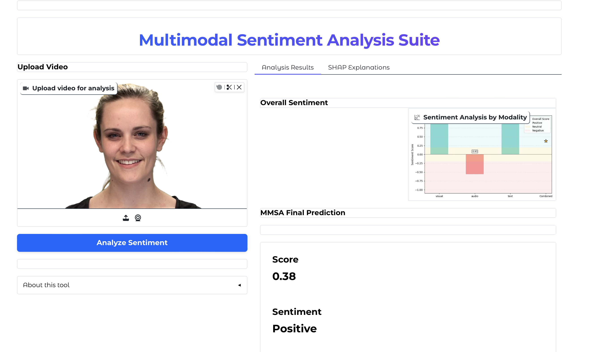
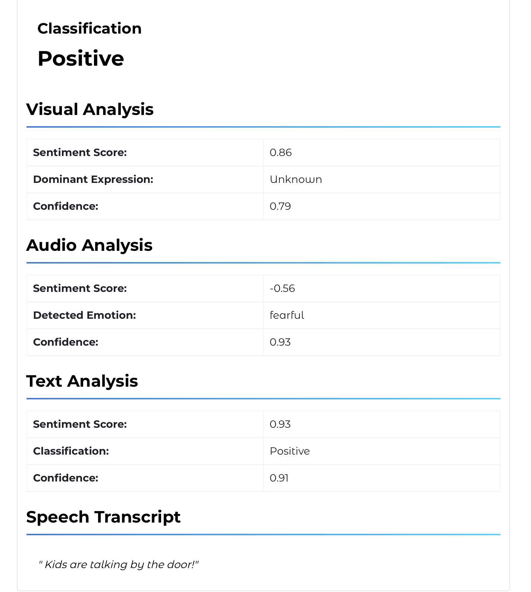
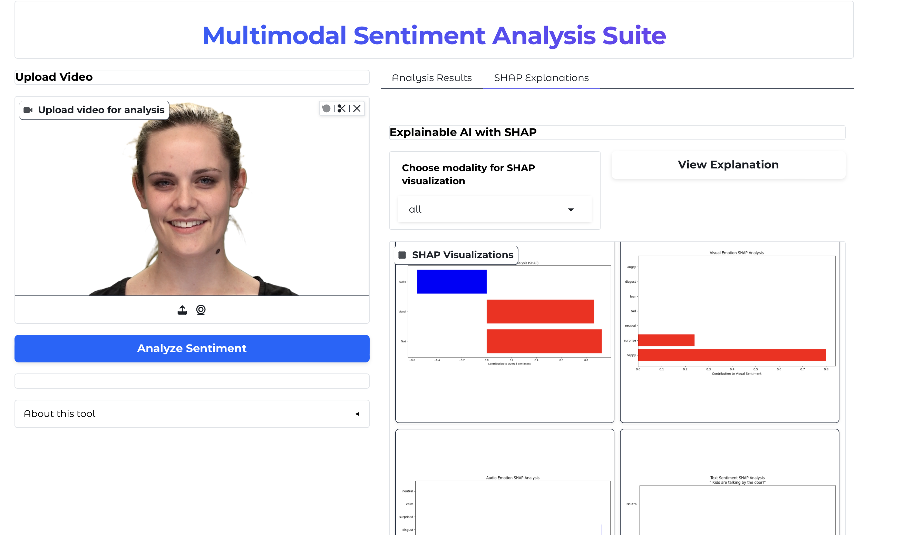

# Multimodal Sentiment Analysis

Estimate the sentiment of a short video clip by looking at three things at once:
the speaker's face, the sound of their voice, and what they actually say. Each
signal is scored on its own, then the three scores are combined into a single
sentiment reading.



Most sentiment tools read text alone. Tone and facial expression carry a lot of
the signal a transcript throws away — "yeah, great" is praise or sarcasm
depending entirely on how it's said. This project is an experiment in fusing all
three channels and showing how each one moved the final number.

> **Status:** research prototype. It runs end to end and is useful for
> exploration, but the fusion is hand-tuned rather than trained, and the audio
> model is trained on acted emotion. Read [Limitations](#limitations) before you
> trust a number.

## How it works

```
          video clip
              │
   ┌──────────┼───────────┐
   ▼          ▼           ▼
 frames     audio     transcript
   │          │           │
 DeepFace   CNN on      RoBERTa
 (face      MFCCs       (Cardiff
  emotion)  (RAVDESS)    Twitter)
   │          │           │
   └──────────┼───────────┘
              ▼
      weighted late fusion
              ▼
     sentiment + per-modality
      contribution charts
```

| Modality | Model | What it produces |
|----------|-------|------------------|
| Visual | [DeepFace](https://github.com/serengil/deepface) with a RetinaFace detector | Facial emotion probabilities per sampled frame |
| Audio | A 2-D CNN over MFCCs, trained on [RAVDESS](https://zenodo.org/record/1188976) | Vocal emotion probabilities |
| Text | [`cardiffnlp/twitter-roberta-base-sentiment-latest`](https://huggingface.co/cardiffnlp/twitter-roberta-base-sentiment-latest) | Positive / neutral / negative over the transcript |

The three scores are combined by a **weighted average** (late fusion). The
weights live in [`src/config.py`](src/config.py) and default to visual 0.45,
audio 0.45, text 0.10 — chosen by hand, not learned. When a modality is missing
(no detectable face, silent clip) its weight is dropped and the rest are
renormalised.

### "Feature contribution" charts, not SHAP

Alongside the score, the app renders bar charts showing how each detected
emotion pushed a modality's score up or down. These are **weighted
contribution charts** — each emotion's probability times its mapped sentiment
weight. They are *not* SHAP (Shapley) values; no coalitional game is solved.
Wiring up a real SHAP explainer is on the [roadmap](#roadmap). The charts are
labelled honestly throughout the UI so nobody mistakes one for the other.

## Getting started

The audio model weights are stored with [Git LFS](https://git-lfs.com), so
install that first or the `.h5`/`.json` files will clone as small pointer stubs.

```bash
git lfs install
git clone https://github.com/AbdullaE100/NEW-MMSA.git
cd NEW-MMSA
git lfs pull

python -m venv venv && source venv/bin/activate
pip install -r requirements.txt
```

Run the web interface:

```bash
python mmsa_interface_with_shap.py          # http://localhost:7860
python mmsa_interface_with_shap.py --share  # temporary public link
```

Process a folder of clips instead of using the UI:

```bash
python run_mmsa.py batch --input examples/ --output results/
```

## What you get



The results view shows the combined sentiment, each modality's individual score,
the transcript, and the per-modality contribution charts.



## Limitations

Being upfront about where this is weak, because it matters for how you read the
output:

- **The fusion weights are hand-tuned, not learned.** 0.45 / 0.45 / 0.10 is a
  prior, not a result validated against labelled data. Different clips would
  likely want different weights.
- **The audio model is trained on RAVDESS** — actors performing emotions on
  demand. It generalises poorly to spontaneous, conversational speech.
- **There are hand-written "positive boosts"** in the per-modality code that
  nudge happy/surprised/calm predictions upward. They improve some demo clips
  but are not principled; see [MODEL_CARD.md](MODEL_CARD.md).
- **No published accuracy number.** The repo does not yet ship an evaluation
  harness with a held-out set, so treat outputs as indicative, not measured.
- **Transcription quality caps text sentiment** — a bad transcript feeds a bad
  text score.

## Roadmap

- Replace the hand-tuned fusion with a small learned head, reported with a
  confusion matrix on a held-out split.
- Real SHAP / Integrated-Gradients attributions for the CNN and RoBERTa.
- An `eval/` harness that reports macro-F1 on RAVDESS and one in-the-wild set.
- Remove the per-modality positive-bias heuristics once fusion is learned.

## Project layout

```
mmsa_interface_with_shap.py   Primary Gradio app (fusion + contribution charts)
app.py                        Hugging Face Spaces entry point
run_mmsa.py                   CLI: `web` and `batch` subcommands
src/
  config.py                   Fusion weights, thresholds, audio geometry
  audio_features.py           Deterministic length-normalisation (unit-tested)
  mmsa_audio_sentiment.py     Audio CNN + feature extraction
  deepface_emotion_detector.py  Facial emotion
  mmsa_text_sentiment.py      RoBERTa text sentiment
  mmsa_gradio_interface.py    Base interface + late-fusion logic
  batch_mmsa_processor.py     Batch runner
tests/                        Dependency-light unit tests
models/                       Audio model + norm params (Git LFS)
```

## Development

```bash
pip install pytest ruff
pytest tests/ -v
ruff check .
```

The unit tests deliberately avoid the heavy ML dependencies so they run in
under a second — they cover the pure logic (deterministic audio framing, config
invariants). CI runs them on every push; see [.github/workflows/ci.yml](.github/workflows/ci.yml).

## License

[MIT](LICENSE).
